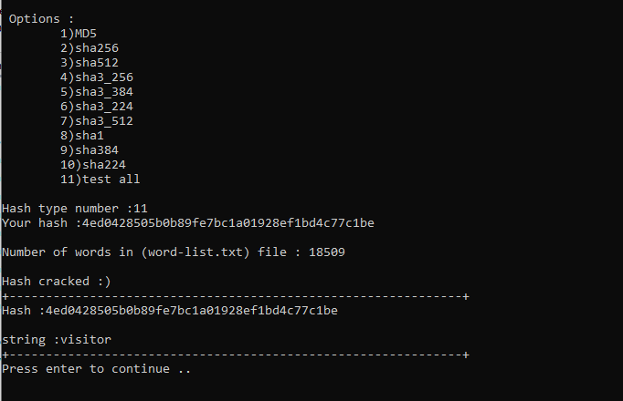

# Hash Cracker
simple hash cracker from `word list` 

# Supported hashes :
- [x] MD5
- [x] SHA256
- [x] SHA512
- [x] SHA3_256
- [x] SHA3_384
- [x] SHA3_224
- [x] SHA3_512
- [x] SHA1
- [x] SHA384
- [x] SHA224

# Note
This program does `not` detect repeted words
- There are some words list in `word-list.txt` file but you can add more words :)

# Run
Just put your words in `word-list.txt` file and start HashCracker.py
- Screenshot

